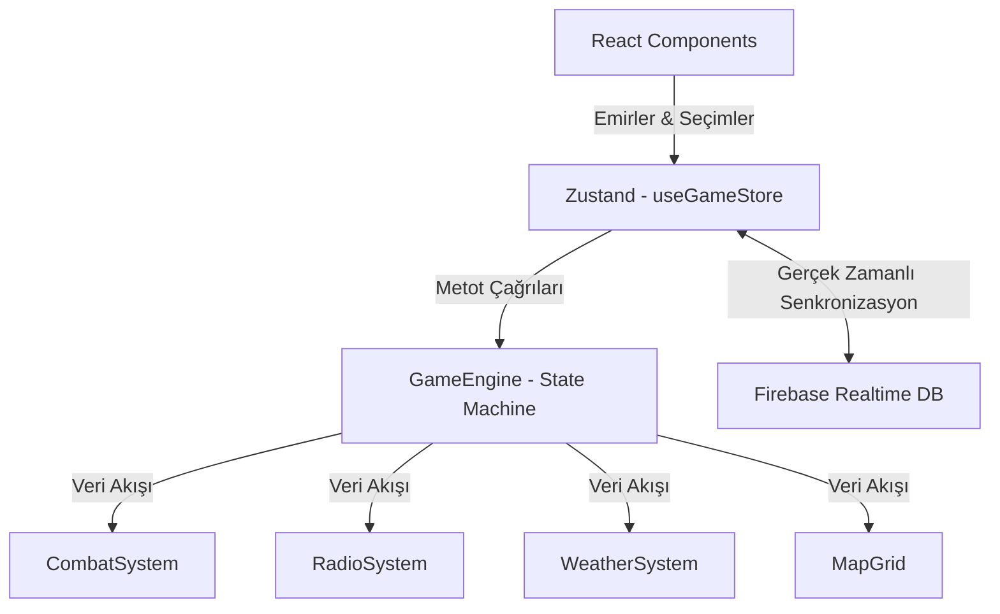
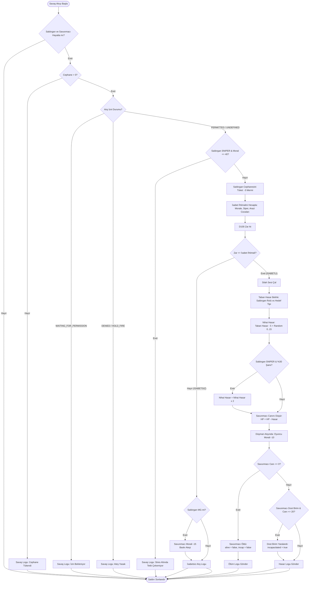

# ⚔️ Taktiksel Manga Yönetim Simülasyonu — Teknik İnceleme Raporu

Bu rapor, **Tactical Simulation Web (v2.0)** projesinin mimarisini, veri akışını, matematiksel modellerini (savaş ve telsiz sistemleri) ve çevrimiçi çok oyunculu yapısını detaylı bir şekilde analiz etmek amacıyla hazırlanmıştır.

---

## 1. Genel Teknoloji Yığını (Technology Stack)

Uygulama, modern bir istemci-tarafı web mimarisine sahiptir ve aşağıdaki teknolojilerle inşa edilmiştir:
- **Temel Yapı:** React 19, TypeScript, Vite (Derleyici ve Geliştirme Sunucusu).
- **Stil Yönetimi:** Vanilla CSS + Tailwind CSS (Bileşen düzeyinde askeri temalı özel arayüz tasarımları ve terminal CRT efektleri).
- **Durum Yönetimi (State Management):** [Zustand](file:///c:/Users/ahmet/.gemini/antigravity-ide/scratch/tactical-sim-web/src/store/useGameStore.ts) (Hafif, tek yönlü veri akışına sahip global store).
- **Veri Tabanı ve Çok Oyunculu Senkronizasyon:** Firebase Realtime Database (Anonim kimlik doğrulama ve gerçek zamanlı 1v1 oda eşleşmeleri).
- **Ses Yönetimi:** Howler.js (Askeri telsiz bip sesleri, silah/patlama efektleri ve savaş alanı ambiyans sesleri).

---

## 2. Sistem Mimarisi ve Dizin Yapısı

Proje, iş mantığını (Business Logic) arayüzden (UI Components) tamamen ayıran temiz bir yazılım tasarımı benimsemiştir:

### Önemli Dizinler ve Dosyalar:
* **[`src/engine/`](file:///c:/Users/ahmet/.gemini/antigravity-ide/scratch/tactical-sim-web/src/engine):** Projenin kalbidir. Zaman, hava durumu, savaş matematiği, askerlerin durumları ve telsiz gecikme hesaplamaları tamamen burada döner.
* **[`src/store/`](file:///c:/Users/ahmet/.gemini/antigravity-ide/scratch/tactical-sim-web/src/store):** Zustand global store dosyasını barındırır. React bileşenleri ile oyun motorunu birbirine bağlar.
* **[`src/components/`](file:///c:/Users/ahmet/.gemini/antigravity-ide/scratch/tactical-sim-web/src/components):** Arayüz bileşenlerini barındırır. (Harita tablosu, telsiz logları, telsiz emir paneli vb.)
* **[`src/services/`](file:///c:/Users/ahmet/.gemini/antigravity-ide/scratch/tactical-sim-web/src/services):** Ses yöneticisi (`AudioManager`) ve çok oyunculu oda mantığı (`MultiplayerLogic`) buradadır.

---

## 3. Simülasyon Akışı ve Zaman Yönetimi (Time Engine)

Oyun, sıra tabanlı (Turn-based) bir yapı yerine **Dakika/Zaman Akışlı Simülasyon** modeli üzerine kuruludur.

1. **`advance(minutes)` Döngüsü:**
   - Oyuncu "Zamanı İlerlet" butonuna bastığında veya simülasyon aktığında [`GameEngine.advance()`](file:///c:/Users/ahmet/.gemini/antigravity-ide/scratch/tactical-sim-web/src/engine/GameEngine.ts#L232-L240) tetiklenir.
   - Her dakika (tick) için sırasıyla:
     - Askerlerin erzak tüketimleri güncellenir.
     - Lojistik ikmal kolilerinin teslimat süreleri kontrol edilir (`deliveryTick`).
     - UH-60 MEDEVAC kurtarma helikopterinin uçuş ve tahliye durumu güncellenir.
     - Hava durumu değişiklik ihtimalleri hesaplanır.
     - Düşman devriyelerinin hareket ve saldırı mantığı işletilir.
     - Telsiz mesaj kuyruğundaki süresi gelen komutlar ve raporlar teslim edilir.

2. **UH-60 MEDEVAC ve Risk Faktörü:**
   - Canı 20'nin altına düşen askerler "Ağır Yaralı" (`incapacitated`) durumuna geçer.
   - Kurtarma helikopteri (`UH-60`) çağrıldığında hedef bölgeye 2 dakikada ulaşır ve 2 dakika yükleme yapar.
   - Yükleme sırasında çevredeki canlı düşman birimlerinin helikoptere olan mesafesine bağlı olarak helikopterin vurulma riski artar (baz risk %5, yakındaki her düşman için +%20).
   - Helikopter vurulursa tüm birimlerin morali 30 puan düşer, asker ölür. Başarıyla tahliye edilirse moralleri 15 puan yükselir.

---

## 4. Telsiz Gecikme ve Sinyal Kaybı Modeli (Radio Propagation)

Telsiz sistemi ([`RadioSystem.ts`](file:///c:/Users/ahmet/.gemini/antigravity-ide/scratch/tactical-sim-web/src/engine/RadioSystem.ts)), oyunun en özgün mekaniğidir. Karargahtan gönderilen emirlerin ve sahadan gelen raporların ulaşması anlık değildir.

### Gecikme Denklemi (Dynamic Delay):
Telsiz gecikmesi (`totalDelay`), aşağıdaki bileşenlerin toplanmasıyla dakika cinsinden hesaplanır:
$$\text{Gecikme} = \text{Taban Gecikme} + \text{Mesafe Etkisi} + \text{Hava Durumu Etkisi} + \text{Stres Etkisi} + \text{Kuyruk Yoğunluğu}$$

- **Mesafe ve Topografya:** Birimin haritadaki konumu ile telsiz rölesi (veya karargah) arasındaki mesafe. Araya giren dağlık araziler sinyal kalitesini doğrudan düşürür.
- **Hava Durumu:** Yağmurlu havalar sinyal gücünü düşürürken, fırtınalı havalarda telsiz iletişimi tamamen kesilebilir.
- **Telsiz Paraziti ve Bozulma (Corruption):**
  - Sinyal gücü düştüğünde telsizden gelen mesajlar otomatik olarak bozunuma uğrar. Metin içerisindeki bazı karakterler `#` ve `*` sembolleri ile yer değiştirir ve mesajın sonuna `[KRKRKk...]`, `[PARAZİT]` gibi statik gürültü etiketleri eklenir.

### ROE (Angajman Kuralları) ve İletişim Kopması:
- Sinyal gücü normal seviyelerdeyken birimler bir düşman tespit ettiğinde karargaha telsizden **Atış İzni İstek Raporu** yollar ve izin verilene kadar bekler.
- Sinyal gücü çok düşük olduğunda (%20'nin altı), askerler karargaha ulaşamayacaklarını bildikleri için telsiz protokolünü devre dışı bırakır ve **inisiyatif kullanarak otomatik olarak Serbest Atış** moduna geçerler.

---

## 5. Savaş Mekanikleri ve Karar Matrisi (Combat Math)

Savaş hesaplamaları [`CombatSystem.ts`](file:///c:/Users/ahmet/.gemini/antigravity-ide/scratch/tactical-sim-web/src/engine/CombatSystem.ts) altında yürütülür:

### İsabet İhtimali Formülü:
$$\text{Isabet İhtimali} = \text{Taban İsabet} + \frac{\text{Saldırgan Morali} - 50}{10} - \text{Savunmacı Siper Modifikatörü} - \text{Arazi Modifikatörü}$$

- **Taban İsabet Oranı:** %50
- **Siper Durumu:** Savunmacı siperde ise isabet şansı 15 puan düşer.
- **Arazi Etkisi:** Savunmacının bulunduğu kare Şehir ise -10, Dağ ise -10, Orman ise -5 puan isabet düşüşü uygulanır.
- **Nihai İsabet:** Asla %5'ten az ve %95'ten fazla olamaz.

### Sınıf/Rol Hasar Çarpanları:
| Saldırgan Sınıfı | Hedef Tipi | Hasar Modeli | Ekstra Özellikler |
| :--- | :--- | :--- | :--- |
| **Keskin Nişancı** | Piyade | Yüksek | %30 şansla Kritik Vuruş (Hasar x 2) |
| **Zırhlı (Tank)** | Piyade/Zırhlı | Çok Yüksek | Alan baskı ateşi ve yüksek hasar |
| **Mühendis** | Zırhlı (Tank) | Kritik Hasar | Düşman zırhlılarına karşı RPG bonusu (+40 Hasar) |
| **Makineli Tüfekçi** | Piyade | Orta (Sürekli) | Düşman birimlerini baskı altına alır (Suppression) ve morallerini yüksek oranda kırar. |

---

## 6. 1v1 Çok Oyunculu Savaş Sistemi (Multiplayer Logic)

1v1 çevrimiçi savaş modu, eş zamanlı veya sıra tabanlı olarak Firebase Realtime DB üzerinden yürütülür.

- **Ev Sahibi (Host) ve Misafir (Guest) Rolleri:**
  - Odadaki iki oyuncu kendi bütçeleri doğrultusunda askerlerini seçer (Drafting Phase) ve kendi bölgelerine yerleştirir (Placement Phase).
- **Zustand & Firebase Senkronizasyonu:**
  - Veri kaybı veya üst üste yazma (Race Condition / Last Write Wins) hatalarını engellemek için, oyuncular hazır bilgisini (`hostReady` / `guestReady`) ve bütçelerini gönderirken karşı tarafın bağımsız alanlarını silerek günceller (`delete data.guestReady`).
- **Kazanma Koşulları:**
  - Haritanın merkezindeki taktiksel bayrağı (`capturePoint`) 3 tur boyunca kesintisiz olarak kontrol altında tutan taraf stratejik zafer elde eder. Veya rakibin tüm birimlerini imha eden taraf maçı kazanır.

---

## 7. Proje İyileştirme Fırsatları (Technical Debt & Improvements)

Proje genel olarak oldukça sağlam kurulmuş olsa da, aşağıdaki konularda optimizasyon ve geliştirmeler yapılabilir:

1. **Performans Optimizasyonu (Grid Rendering):**
   - Harita büyüdükçe (örneğin 20x20 büyük haritalarda) React hücrelerinin tamamının her tick'te yeniden render edilmesi yavaşlamalara neden olabilir. Harita hücreleri `React.memo` ile sarmalanabilir veya sadece değişen hücreler güncellenebilir.
2. **Çok Oyunculu İletişim Güvenliği:**
   - Şu anki yapıda tüm oyun durumu istemci tarafında simüle edilip Firebase'e yazılmaktadır. Bu durum hile yapılmasına elverişlidir. İleride oyun mantığını yürüten küçük bir Node.js sunucu entegrasyonu düşünülebilir.
3. **Yapay Zeka (Enemy AI) Davranış Çeşitliliği:**
   - Düşman devriyeleri şu anda rastgele hareket ve basit menzil taraması yapmaktadır. A* yol bulma algoritması entegre edilerek engellerin arkasından sızma veya bayrak noktasına organize taarruz yapabilmeleri sağlanabilir.

---

## 8. Detaylı Savaş Mantığı Akış Diyagramı (Combat Flowchart)

Aşağıdaki akış şeması, sahadaki dost/düşman birimlerinin birbirlerine gerçekleştirdikleri saldırıların simülasyon motorundaki karar ağacını ve algoritmasını göstermektedir:

---

## 9. Savaş Mantığı Değerlendirmesi ve Algoritma Adımları

Savaş sistemi, manga seviyesindeki bir askeri operasyonun stresini ve fiziksel şartlarını simüle etmek üzere oldukça detaylı tasarlanmıştır. Algoritma şu 4 ana evreden oluşur:

### A. Ön Koşul Kontrolleri (Pre-Checks)
- **Hayatta Kalma Kontrolü:** Ölü birimler ateş edemez ve hedef alınamaz.
- **Lojistik Kontrolü:** Her saldırı **3 cephane** harcar. Cephanesi olmayan birim ateş edemez.
- **ROE (Kurallar) Kontrolü:** Karargahtan izin alınmamışsa (`WAITING_FOR_PERMISSION`) veya ateş kes emri verilmişse (`HOLD_FIRE`), birimler ateş açmaz.
- **Moral/Stres Kısıtı:** Keskin nişancılar (`SNIPER`) yüksek stres altındayken (Moral $\le 40$) elleri titrediği için atış gerçekleştiremezler.

### B. Olasılıksal İsabet Hesaplama (Hit Roll)
İsabet olasılığı dinamik olarak hesaplanır. Baz değer dost birimler için **%50**, düşmanlar için **%40**'tır.
- Saldırganın morali 50'nin üzerindeyse isabet şansı artar, altındaysa düşer (Moral farkının 10'a bölümü oranında modifikatör).
- Hedef siperdeyse **-15%** ceza uygulanır.
- Hedefin arazisine göre isabet cezası eklenir: Şehir / Dağ için **-10%**, Orman için **-5%**.
- Nihai isabet oranı kesinlikle **%5** ile **%95** arasına sabitlenir (şans veya garantili atış sınırı).
- 100 yüzeyli bir zar (`d100()`) atılır. Zar değeri isabet olasılığından küçükse isabet sağlanır.
- **Baskılama (Suppression):** Makineli Tüfekçilerin (`MG`) atışları ıskalasa dahi hedefin moralini **15 puan** birden düşürerek onların atış hassasiyetini ve hareket kabiliyetini kırar (baskı ateşi).

### C. Dinamik Hasar Hesaplama (Damage Roll)
İsabet durumunda taban hasar, tarafların sınıflarına göre tayin edilir:
- **Dost Zırhlı (Tank) Saldırısı:** Normal hedeflere 45, zırhlı hedeflere 30 taban hasar verir.
- **Mühendis RPG Saldırısı:** Düşman zırhlılarına karşı 40 taban hasar verirken, piyadelere 20 taban hasar verir.
- **Keskin Nişancı Kritik Atışı:** Keskin nişancı atışlarında %30 ihtimalle hasar **2 katına** katlanır (Kritik İsabet).
- Hasar dalgalanması olarak hesaplanan hasara **-5 ile +10** arasında rastgele bir değer eklenir.

### D. Durum ve Moral Güncellemeleri (State Resolution)
- Hasar alan birimin canı (`HP`) düşürülür.
- Dost askerlerin canı 20'nin altına düşerse **Ağır Yaralı** (`incapacitated`) durumuna geçerler. Ağır yaralı askerler hareket edemez, ateş edemez ve tahliye (`MEDEVAC`) edilmedikleri takdirde bir sonraki saldırıda ölebilirler.
- Canı 0 veya altına inen birimler savaş dışı kalır (`alive = false`).
- Düşman saldırılarında isabet alan dost askerlerin morali ek olarak **10 puan** düşer.

